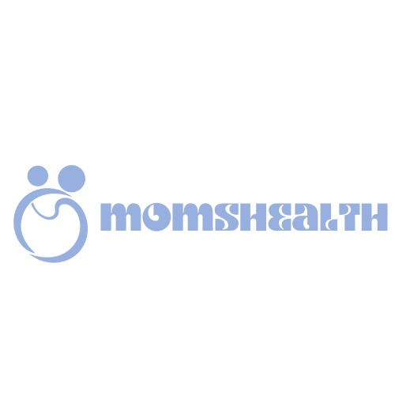

# MomsHealth - Complete Health Care Solution

## Project Overview

MomsHealth is an innovative health platform that provides a comprehensive solution for maternal care. We aim to provide universal access to quality healthcare, good information, and holistic well-being.

## Key Features

- Online Booking: Facilitates users to make appointments online.
- Blogs: A source of useful information related to pregnancy and healthcare.
- Sakura: our chatbot designed to assist users with their questions.

## Technologies Used

- **HTML, CSS, JavaScript (JS):** Front-end technologies for building the user interface and enhancing user experience.
- **MySQL:** Database for storing and managing data.
- **Railway:** A platform for deploying and managing databases and backend services easily.

## Testimonials

- "Amazing platform! Very satisfied with the healthcare services provided." - Abus

---

© Copyright Year Group N-27 RevoU. All Rights Reserved.
